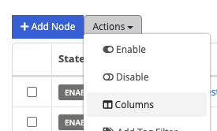
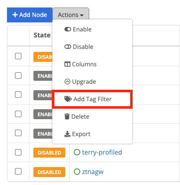
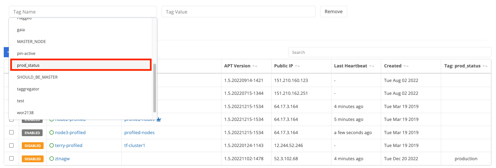

{}
A node is an instance of software used for building connections, managing compute resources, and deploying software.
{}

## Node Types

A node can be installed on a hardware appliance, as a virtual appliance (Vsphere and Hyper-V), and deployed in a public cloud (Amazon AMI, Google, Microsoft). There are three main types of nodes - Edge, Gateway, and Management.

All Trustgrid nodes run on a hardened Ubuntu operating system. Nodes are managed through the Trustgrid portal or via the API (requires authentication token). A local UI exists to support the reconfiguration of an ethernet interface and diagnostic/network tests prior to connection to the Portal.

### Edge Nodes

Edge Nodes build outgoing TLS tunnels to Gateway Nodes. Bidirectional traffic is supported through this tunnel, subject to ACLs and [security]() policy restrictions. Edge Nodes will only require a firewall rule change if outbound internet restrictions are in place. Edge nodes can be a target for software deployment. Edge Nodes can be deployed with a single or multiple ethernet connections to support deployments behind a firewall or adjacent to a firewall (public WAN / private LAN).

### Gateway Nodes

Gateway Nodes accept incoming TLS tunnels from Edge Nodes. Traffic on these tunnels is bidirectional, as permitted by ACLs or policy. Gateway Nodes usually require a firewall change to permit the incoming traffic. Gateway Nodes are identical to Edge Nodes but with a gateway configuration applied. Gateway nodes only connect to other gateways if one is of type `hub`. Read more about [gateway configuration]().

### Management Nodes
Management Nodes are not like other [nodes]() because they do not connect to the data plane, only the control plane. Management Nodes are deployed by Trustgrid for each customer and are multi-tenant like other control plane components. Customers may elect to deploy their own Management Nodes in place of multi-tenant Management Nodes. Management Nodes facilitate the monitoring, management, and support of Edge and Gateway Nodes.

## Node List View

### Adding a Tag as a Column on the Nodes Table

Adding a tag as a column on the nodes tables is good way to make valuable information visible for multiple nodes at the same time. To add the column:

1. Navigate to the nodes table page
1. Click `Actions` and then select `Columns` from the dropdown

3. Towards the bottom you will see all the available tags in the format `tag: tag-name`. Select the desired tag and click `Save`.

The column will be added and the table can now be sorted by that column. Any node that does not have that tag set will be listed as blank.

### Applying a Tag Filter to the Nodes Table

The nodes table can also be filtered to only show nodes with a specific tag name:value.

1. On the nodes table click `Actions` and select `Add Tag Filter` from the drop-down menu.

1. After clicking `Add Tag Filter`, select the tag-name field and you will see a list of tag-names available. Select the desired tag.

You can also start typing to filter what tag names are shown.

3. Select the tag value field and you will see a list of available values. Select the desired value.

4. (Optional) Click `Add Tag Filter` to include an additional filter. Note that the two filters will be applied using AND only nodes with both tag name:value combinations matching will be shown.

5. Click `Apply Tag Filter` and the table will only show matching nodes.

