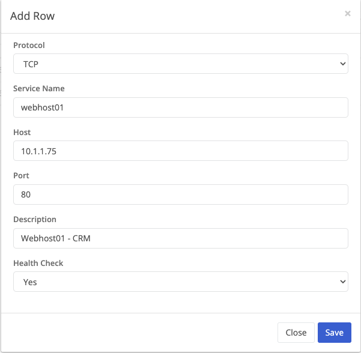

{}
Services are configured in conjunction with [connectors]() to define a remote host:port to connect to for layer 4 (L4) connectivity.
{}

#### Configuration

Services are configured under the Networking > Services tab of the node or cluster configuration section in the Trustgrid Portal.



The protocol of the service to connect to. Options are TCP, UDP, FTP, and TFTP, along with pre-defined default ports for RDP, SSH, and VNC.


> FTP must operate in passive mode when using L4 services and connectors


A friendly name for the service that will be used in the Remote Service field of a [connector]().



The IP of the host to connect to.



The port to connect to on the host.



A health check can be configured for TCP services. The health check will attempt a TCP connectivity check once per minute. After 5 consecutive failures, an Outbound L4 Service Health Check alert will be triggered and clustered nodes will be marked as unhealthy. Clustered nodes will return to a Healthy status after 5 consecitive connection attempts are successful.


