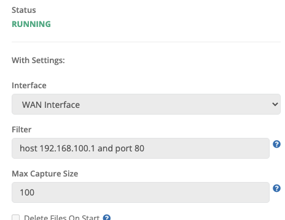

## Container  Improvements
Trustgrid has greatly enhanced the container features we support and this release makes these features available to all users.

### Container Management 
You can now stop and start individual containers running as a service from within the portal. 

### Container Volumes and Mounts
Containers on Trustgrid now support creating persistent volumes and mounting them within the container.  These volumes can even be encrypted using Trustgrid managed, software-based encryption.

### Container Privileges 
It is now possible to run containers as a privileged user or specify the user/group the container should execute as. Additionally, you can add or drop Linux capabilities that the container has enabled on execution.

### Import Container Configuration
Container configurations can end up complex. Recreating on many nodes is tedious and error prone. Trustgrid now supports importing the configuration from an existing node or cluster that has the container defined as desired.

## Interactive Tools Improvements

### Terminate Running Tools without Closing Window
Interactive tools such as Terminal and Sniff Traffic now support terminating the session without closing the window. This can be useful in situations, such as if sniffing traffic on a very active node, where you want to be able to stop the tool but still be able to analyze the output. 

### Traffic Capture Tool Improvements
The Traffic Capture tool now displays the settings used while running. This includes the interface and filter.

 
## Provisioning and Order Management Improvements
The Provisioning section of the Trustgrid portal has been extensively overhauled to improve the order management experience and make future improvements easier.

### New Look
The first change you’ll notice is that clicking Provisioning opens a new tab. The orders table now makes it easier to search and filter the results.  

The individual order screen is now a single page view to reduce the need to switch between tabs.  And orders now support attaching files such as legacy device configurations or diagrams that might be useful for configuring the new devices. 

### Order Notifications 
You can now configure [Alarm Filters]() for four new order based events:

* Order Created
* Order Commented
* Order Status Change
* Order Customer Update 

These events can then be sent to existing or newly defined [channels]().

